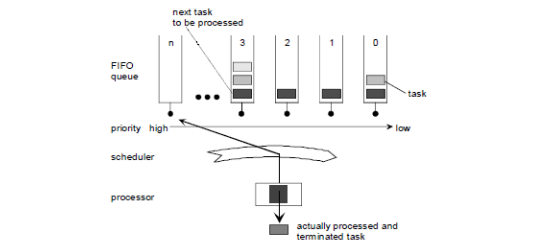

### Лабораторная работа 

**Описание работы модели/системы:** 

Операционная система обеспечивает контролируемое выполнение в реальном времени нескольких процессов и обеспечивает параллельное и асинхронное выполнение задач. 

В системе присутствует планировщик, который организует последовательность выполнения задачи. 

В системе может быть два типа задач: 

- основные 
- расширенные 

#### Основные задачи

Основные задачи освобождают процессор если: 

- Задача завершилась, 
- Произошло переключение на более приоритетную задачу. 

#### Расширенные задачи

Расширенные задачи отличаются от основных тем, что они могут находится в состоянии ожидания(WaitEvent). Состояние ожидания позволяет процессору быть освобожденным и переназначенным на задачу с более низким приоритетом без необходимости завершать выполнение расширенной задачи. 

Расширенные задачи имеют четыре состояния: 

- **running -** Выполнение задачи. Только одна задача может находиться в этом состоянии в любой момент времени. 
- **ready -** Задача завершила свое выполнение. Планировщик решает, какая готовая задача будет выполнена следующей. 
- **waiting -** задача ожидает выполнения другого события 
- **suspended  -** задача находится в подвешенном состоянии и может быть 

  активирована. 

**Возможные состояния и переходы расширенной задачи.** 

*Рисунок 1 Расширенная модель переходов.* 

|**Переход** |**Прежнее состояние** |**Новое состояние** |**Описание** |
| - | - | - | - |
|**activate** |*suspended* |*ready* |Новая задача переводится в состояние готовности. |
|**start** |*ready* |*running* |Выполняется готовая задача, выбранная планировщиком. |
|**wait** |*running* |*waiting* |Переход в состояние ожидания. Выполнение задачи продолжится только после выполнения события. |
|**release** |*waiting* |*ready* |Произошло по крайней мере одно событие, которое ожидала задача. |
|**preempt** |*running* |*ready* |Планировщик решает  начать другую задачу. Запущенная задача переводится в состояние готовности. |
|**terminate** |*running* |*suspended* |Задача переходит в подвешенное состояние |

**Завершение задачи возможно только в том случае, если она завершается сама**. Это ограничение снижает сложность операционной системы. Прямого перехода из состояния *suspended* в состояние *waiting* не предусмотрено. 

**Возможные состояния и переходы базовых задач.** 

Модель состояний базовых задач практически идентична модели состояний расширенных задач. Единственным отличием является то, что основные задачи не имеют состояния ожидания. 

- **running -** Выполнение задачи. Только одна задача может находиться в этом состоянии в любой момент времени. 
- **ready -** Задача завершила свое выполнение. Планировщик решает, какая готовая задача будет выполнена следующей. 
- **suspended  -** задача находится в подвешенном состоянии и может быть 

  активирована. 

*Рисунок 2 Модель переходов состояний базовой задачи* 

|**Переход** |**Прежнее состояние** |**Новое состояние** | **Описание**                                                                               |
| - | - | - |--------------------------------------------------------------------------------------------|
|**activate** |*suspended* |*ready* | Новая задача переводится в состояние готовности.                                           |
|**start** |*ready* |*running* | Выполняется задача, выбранная планировщиком.                                               |
|**preempt** |*running* |*ready* | Планировщик запускает другую задачу. Запущенная задача переводится в состояние готовности. |
|**terminate** |*running* |*suspended* | Запушенная задача переходит в состояние *suspended*                                       |

**Механизм переключения задач** 

За переключение задач отвечает планировщик. Планировщик - это своего рода ресурс, который захватывается и освобождается задачами. Таким образом, задача может зарезервировать планировщик, чтобы избежать переключения задачи до тех пор, пока она не будет освобождена. 

**Приоритеты задач** 

Планировщик выбирает задачи для выполнения из списка задач, которые находятся в состоянии ready основываясь на их приоритете. 

Всего существует три уровня приоритета 0-3, где 0 – это наименьший приоритет задачи. 

Задачи с одинаковым уровнем приоритета запускаются в зависимости от порядка их активации, при этом расширенные задачи в состоянии ожидания не блокируют запуск последующих задач с одинаковым приоритетом. 

Выбор задач происходит по алгоритму FIFO, сначала выполняется первая (самая старая) задача из списка задач с одинаковым приоритетом. Задача, переходящая из состояния ожидания, рассматривается как последняя (самая новая) задача в очереди ready. Планировщик имеет ограничение по количеству задач, которые могут находиться в состоянии ready. 

На рис 3 продемонстрирован пример реализации планировщика, используемого для каждого уровня приоритета. Несколько задач различных приоритетов находятся в состоянии ready, три задачи с приоритетом 3, одна задача с приоритетом 2, одна с приоритетом 1 и две задачи с приоритетом 0. Задача, которая прождала больше всего времени, в зависимости от порядка запроса, находится в нижней части каждой очереди. 

После того как процессор обработал и завершил задачу, планировщик выбирает следующую задачу для обработки (приоритет 3, первая очередь). Задачи с приоритетом 2 могут быть обработаны только после того, как все задачи с более высоким приоритетом перейдут из состояний running и ready. 

*Рисунок 3 Пример работы планировщика, порядок событий*

### Варианты

**Вариант №1** 

- Описать с помощью TLA+ (можно выбрать другой инструмент для верификации) представленную модель операционной системы, которая служит основой для независимы прикладных программ, и обеспечивает их среду на процессоре.  

* Необходимо проверить следующие требования:
  * Высокоприоритетная задача не может ожидать завершения работы низкоприоритетной 
  * Две задачи не могут одновременно находиться на исполнении 
  * Не более N задач могут находится в состоянии ready 
- Для каждого требования написать тест-кейсы. 

**Вариант №2** 

Необходимо реализовать программу по представленному описанию. 

Требования: 

- Язык программирования – любой 
- Протестировать написанный код. Покрытия тестами не менее 80% (использовать инструменты оценки тестового покрытия) 
- Написать отчет о тестировании 
- Обязательно наличия модуля/сервиса для генерации задач. 
